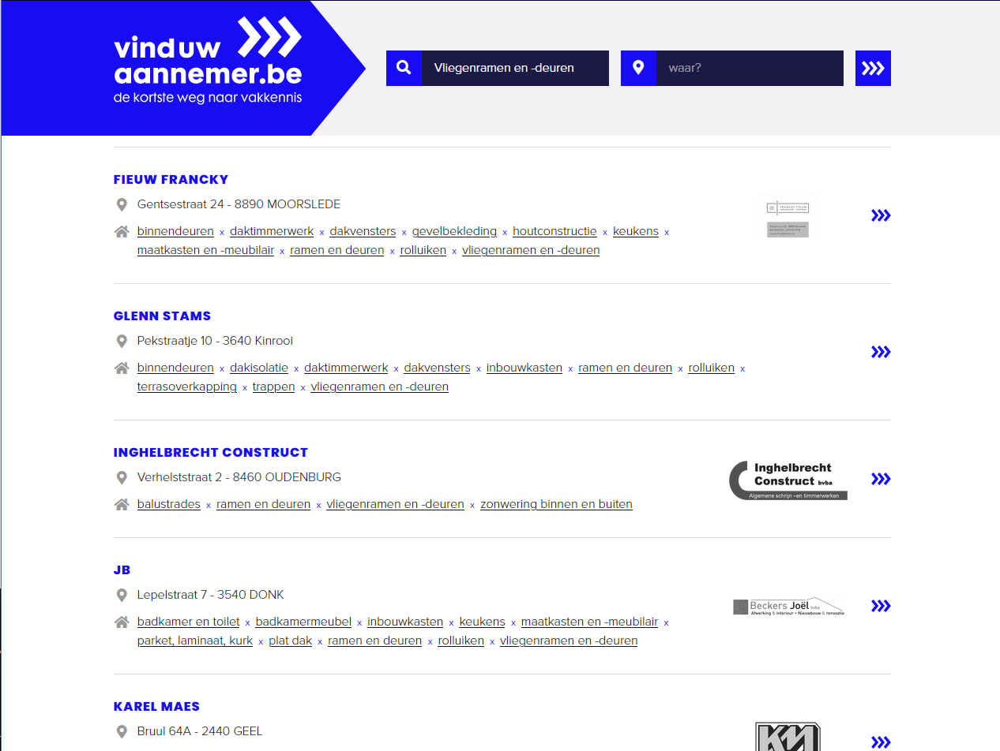
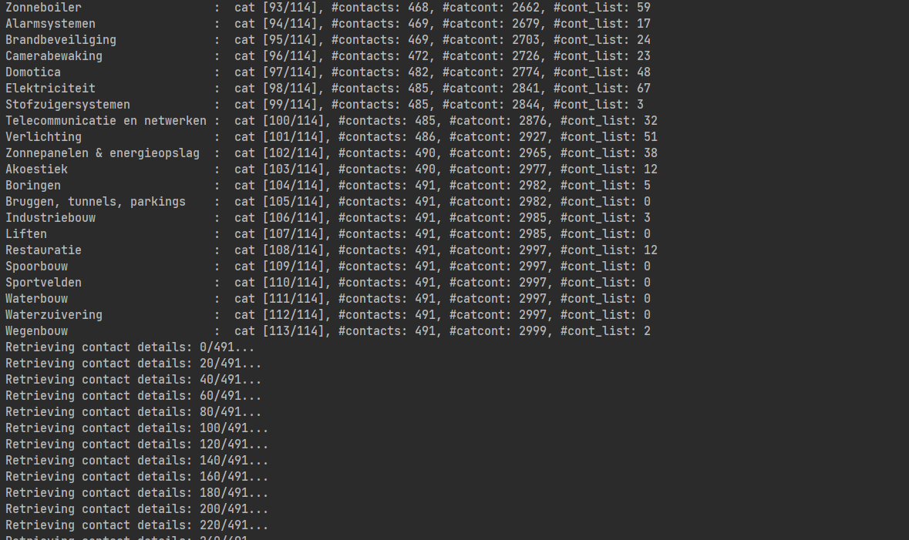
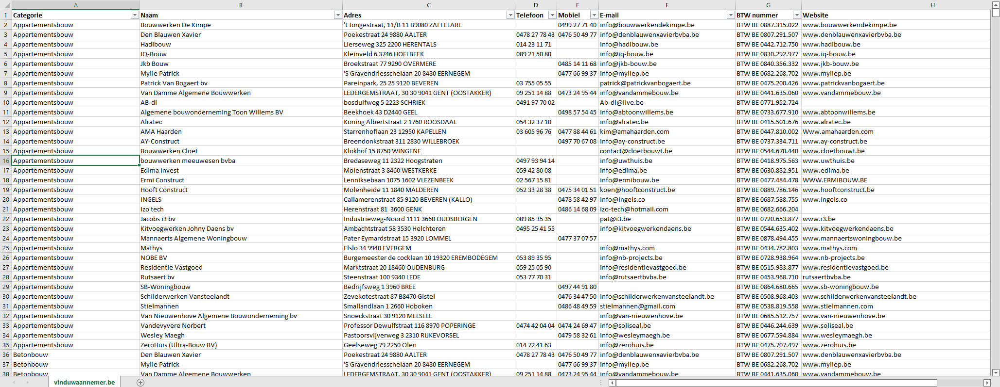

# VindUwAannemer.be

Webscraping tool voor VindUwAannemer.be

**From UpWork job with description:**

> We are searching for a way to collect data from 2 websites:
>- https://www.vinduwaannemer.be
>- https://www.buildyourhome.be
> we need the catagorie (for example roof builder/ woodconstruction etc....) and company details

Goal was to scrape the site and collect contact details of the contractors per category. This was done using Python, Beautiful Soup, selenium and threading. The output was written to a tab separated file for further processing. Some of the challenges:
-	Defining the data structure 
-	Scraping categories from main page with Beautiful Soup
-	Per category page scraping URLs for contact details with Selenium
o	Page loads and presents data with JavaScript
o	Cookie accept dialogue needs to be handled
o	Page loads more data when scrolled at end of page
o	Waiting time to let it complete loading is essential
o	Empty pages and redirecting to the Contractor page when only one
-	Per collected URL collect contact details with Beautiful Soup.
o	Implement multi-threading for more efficient processing
-	Writing collected data to the .tsv file

[comment]: <> (<kbd> &nbsp; </kbd>)
